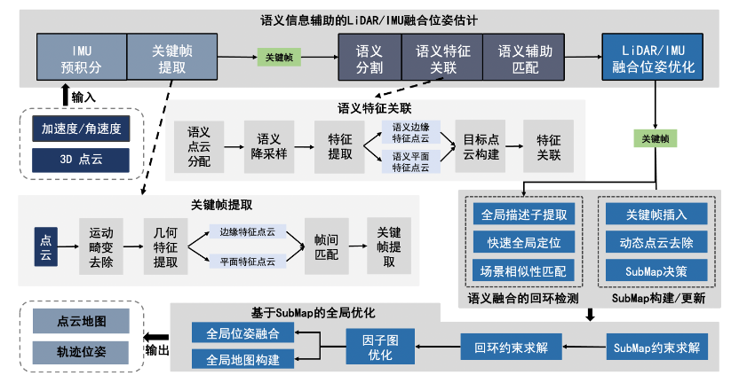
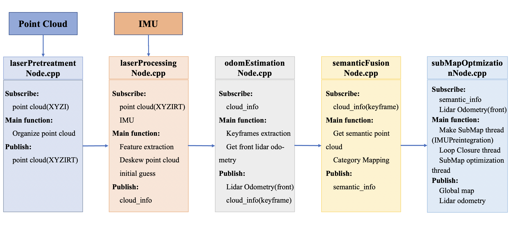

# LIS-SLAM

## Advanced implementation of EPSC-LOAM

The accurate and stable laser SLAM algorithm framework LIS-SLAM is implemented through **semantic information-aided LiDAR/IMU fusion pose estimation** method, **semantic information fusion loop closure detection** method and **global optimisation method based on SubMap**.

<p align='center'>
    
</p>

**Modifier:** [QZ Wang](http://www.wang.qingzhi@outlook.com)

## 1. System architecture

<p align='center'>
    
</p>

## 2. Prerequisites
##### System dependencies
- Ubuntu 64-bit 16.04 or 18.04.
- ROS Kinetic or Melodic. [ROS Installation](http://wiki.ros.org/ROS/Installation)

First you need to install the nvidia driver and CUDA.

- CUDA Installation guide: [Link](https://docs.nvidia.com/cuda/cuda-installation-guide-linux/index.html)

注意这里推荐使用deb方式安装，同时注意CUDA和TensorRT版本对应。

- other dependencies:

  ```sh
  $ sudo apt-get update 
  $ sudo apt-get install -yqq  build-essential python3-dev python3-pip apt-utils git cmake libboost-all-dev libyaml-cpp-dev libopencv-dev
  ```

##### Python dependencies

- Then install the Python packages needed:

  ```sh
  $ sudo apt install python-empy
  $ sudo pip install catkin_tools trollius numpy
  ```

##### TensorRT

In order to infer with TensorRT during inference with the C++ libraries:

- Install TensorRT: [Link](https://developer.nvidia.com/tensorrt).
- Our code and the pretrained model now only works with **TensorRT version 5** (Note that you need at least version 5.1.0).
- To make the code also works for higher versions of TensorRT, one could have a look at [here](https://github.com/PRBonn/rangenet_lib/issues/9).

##### GTSAM
Follow [GTSAM Installation](https://github.com/borglab/gtsam/releases).
  ```sh
  $ wget -O ~/Downloads/gtsam.zip https://github.com/borglab/gtsam/archive/4.0.2.zip
  $ cd ~/Downloads/ && unzip gtsam.zip -d ~/Downloads/
  $ cd ~/Downloads/gtsam-4.0.2/
  $ mkdir build && cd build
  $ cmake -DGTSAM_BUILD_WITH_MARCH_NATIVE=OFF ..
  $ sudo make install -j8
  ```

##### PCL
Follow [PCL Installation](http://www.pointclouds.org/downloads/linux.html)

## 3. Build LIS-SLAM
Clone the repository and catkin_make:

  ```sh
  $ cd ~/catkin_ws/src
  $ git clone https://gitee.com/QingzhiWang/lis-slam.git
  $ cd ../
  $ catkin_make
  $ source ~/catkin_ws/devel/setup.bash
  ```

## 4. Prepare test data
##### Laser data
  - The conversion of laser data is provided in laserPretreatment.cpp. You only need to modify 'N_Scan' and 'horizon_SCAN' of your 3D Lidar in "config/params.yaml".

##### IMU data
  - **IMU alignment**. LIS-SLAM transforms IMU raw data from the IMU frame to the Lidar frame, which follows the ROS REP-105 convention (x - forward, y - left, z - upward). To make the system function properly, the correct extrinsic transformation（'extrinsicRot' and 'extrinsicRPY'） needs to be provided in "config/params.yaml" file. 

##### Rangenet_lib model
- To run the demo, you need a pre-trained model, which can be downloaded here, [model](https://www.ipb.uni-bonn.de/html/projects/semantic_suma/darknet53.tar.gz). The model path needs to modify 'MODEL_PATH' in "config/params.yaml" file. 

- For more details about how to train and evaluate a model, please refer to [LiDAR-Bonnetal](https://github.com/PRBonn/lidar-bonnetal).

**Notice**: for the first time running, it will take several minutes to generate a `.trt` model for C++ interface.

## 5. Your datasets
Modify related parameters in params.yawl.

  ```sh
  $ roslaunch lis_slam run.launch
  $ rosbag play YOUR_DATASET_FOLDER/your-bag.bag
  ```


## 6. KITTI Example (Velodyne HDL-64)
Download [KITTI Odometry dataset](http://www.cvlibs.net/datasets/kitti/eval_odometry.php) to YOUR_DATASET_FOLDER and convert KITTI dataset to bag file. 
Modify related parameters in params.yawl.

  ```sh
  $ roslaunch lis_slam run.launch
  $ rosbag play YOUR_DATASET_FOLDER/your-bag.bag
  ```

## 7.Acknowledgements
LIS-SLAM is based on LOAM(J. Zhang and S. Singh. LOAM: Lidar Odometry and Mapping in Real-time) LIO-SAM,Rangenet_lib.


